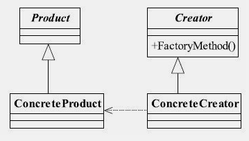
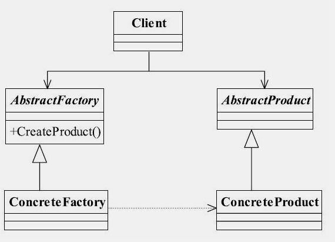

# 设计模式之禅 学习


## 1：6大设计原则


### 1.1 单一职责原则

单一职责原则有以下好处：

- 类的复杂性降低，实现什么职责都有清晰明确的定义
- 可读性提高，复杂性降低
- 可维护性提高，可读性提高
- 变更引起的风险降低

### 1.2 里氏替换原则

**继承的优点：**

- 代码共享，减少创建类的工作量。每个子类都拥有父类的方法和属性
- 提高代码的重用性
- 子类可以形似父类，但又异于父类。
- 提高代码的可扩展性
- 提高产品或项目的开放性

**继承的缺点：**

- 继承是侵入性的

- 降低代码灵活性

- 增加了耦合性

  


 	C++采用多继承的规则，一个子类可以继承多个父类。从整体上，利大于弊，怎么能让利的因素发挥到最大的作用，同时减少弊的麻烦，**解决办法是引入里氏替换原则**。

```java
/*	通俗的讲，只要父类能出现的地方，子类就能出现，而且替换子类也不会产生任何错误异常，或者可能根本就不需要知道是父类还是子类。但是返回来就不行了，有子类出现的地方，父类未必就能适应。
*/
```


### 1.3 依赖倒置原则

依赖的3种写法

​	1 构造函数传递依赖对象

​	2 setter方法传递依赖对象

​	3 接口声明依赖对象


### 1.4 接口隔离原则

​	把一个臃肿的接口更变为两个独立的接口所依赖的原则就是接口隔离原则。通过分散定义多个接口，可以预防未来变更的扩散。


### 1.5 迪米特法则

​	也叫做最少知识原则。通俗的说，一个类应该对自己需要耦合或者调用的类知道的最小。


### 1.6 开闭原则


## 2：23种设计模式


### 2.1 单例模式


#### 定义

> 确保某个类只有一个实例，而且自行实例化并向整个系统提供这个实例

#### 单例模式优点

- 由于内存中只有一个实例，减少了内存开支。特别是一个对象频繁地创建、销毁，且创建销毁时性能又无法优化，单例模式优势很明显。
- 减少了系统性能开销(当一个对象的产生需要比较多的资源时，如读取配置文件、产生其他依赖对象时，则可以通过在应用启动时直接产生一个单例对象，然后永久驻留内存的方式来解决(在JavaEE中采用单例模式需要注意JVM垃圾回收机制))
- 单例模式可以避免对资源的多重占用。
- 单例模式可以在系统设置全局的访问点，优化和共享资源访问。

#### 单例模式的缺点

- 单例模式一般没有接口，扩展困难，如果要扩展，除了修改代码基本上没有第二种途径。

```java
#dd//单例模式为什不能增加接口？
   //因为对接口对单例模式没有任何意义，它要求“自行实例化”，并提供单一实例，接口或者抽象类不可能被实例化
```

- 单例模式对测试不利。
- 单例模式和单一职责原则冲突。`一个类应该只实现一个逻辑，而不关心它是否是单例，是不是要单例取决于环境，单例模式把“要单例”和业务融合在一个类中。`

#### 单例的使用场景

​	在一个系统中，要求类有且仅有一个对象，如果出现多个对象会有“不良反应”，可以采用单例。

- 要求生成唯一序号的环境
- 在整个项目中需要一个共享访问点或共享数据。(WEB页面的计数器，不用每次刷新都记录到数据库中，使用单例模式保持计数器的值，并确保是线程安全的)
- 创建一个对象需要消耗的资源过多`如访问IO和数据库等资源`
- 需要大量定义的静态常量和静态方法(工具方法)的环境中，可以采用单例(也可以直接声明为static)


#### 单例模式的注意事项


```java
---------------------饿汉单例(线程安全)----------------
public class Singleton {
	private static final Singleton singleton = new Singleton();
	// 限制产生多个
	private Singleton() {
	}
	public static Singleton getSingleton() {
		return singleton;
	}
	public static void doSomething() {
	}
}
---------------------懒汉单例(线程不安全)--------------
public class Singleto {
	private static Singleto singleto = null;
	// 限制产生多个对象
	private Singleto() {
	}
	
	public static Singleto getSingleto(){
		if(singleto==null){
			return new Singleto();
		}
		return singleto;
	}
} 
   

```

​	高并发的情况下。懒汉模式存在线程安全问题。

​	如果一个对象执行到了`singleto= new Singleto();` ，但是还没获取到对象(对象初始化需要时间)。第二个线程也执行`singleto==null` ，那么 也会产生一个新对象，因此产生了2个对象。

​	解决线程安全可以使用`synchronized` ，但不是最优秀的单例模式。

​	其次，需要考虑对象复制。对象默认是不可被复制的，若实现了`Cloneable`  接口，通过复制创造一个新对象，对象复制不是通过调用类的构造函数。因此即使使用私有构造函数，对象仍然可以被复制。`解决办法是单例类不要实现Cloneable` 。


#### 单例中允许存在2个对象

```java
public class Emperor {
	// 定义最多能产生的实例数量
	private static int maxNumOfEmperor = 2;
	// 每个皇帝的名字
	private static ArrayList<String> nameList = new ArrayList<String>();
	// 容纳皇帝的实例
	private static ArrayList<Emperor> emperorList = new ArrayList<Emperor>();
	// 当前皇帝的序号
	private static int countNumOfEmperor = 0;

	// 产出所有对象
	static {
		for (int i = 0; i < maxNumOfEmperor; i++) {
			emperorList.add(new Emperor("皇帝" + (i + 1)));
		}
	}

	public static Emperor getInstance() {
		// 随机
		countNumOfEmperor = new Random().nextInt(maxNumOfEmperor);
		return emperorList.get(countNumOfEmperor);
	}

	private Emperor() {

	}

	// 传入名称，建立一个对象
	private Emperor(String name) {
		nameList.add(name);
	}

	public static void say() {
		System.out.println(nameList.get(countNumOfEmperor));
	}
	public static void main(String[] args) {
		int minSnum=5;
		for (int i = 0; i <minSnum; i++) {
			Emperor instance = Emperor.getInstance();
			System.out.print("第"+(i+1)+"个大臣 拜见的是");
			instance.say();
		}
		/*
		 * 第1个大臣 拜见的是皇帝1 
		 * 第2个大臣 拜见的是皇帝1 
		 * 第3个大臣 拜见的是皇帝2 
		 * 第4个大臣 拜见的是皇帝1 
		 * 第5个大臣 拜见的是皇帝2
		 */

	}
}
```


### 2.2 工程方法模式

#### 定义

`定义一个用于常见对象的接口，让子类决定实例化哪一个类。工厂方法使一个类的实例化延迟到其子类`

-------

**工厂类的通用类图**



#### 工厂方法模式优点

```shell
# 1 降低了模块间的耦合。
# 2 工厂方法模式的扩展性非常优秀
# 3 工厂方法模式是典型的解耦框架

```

#### 使用场景

```shell
# 1 工厂方法模式是new一个对象的替代品，因此在所有需要生产对象的地方都可以使用。(但是要慎重考虑增加一个工厂类进行管理带来的代码复杂度)
# 2 可以用在灵活可扩展的框架。
# 3 工厂方法模式可以用在异构项目中，例如WebService与非JAVA项目的交互。

```


#### 工厂方法模式的扩展

​	工厂方法模式扩展很多，而且与其他摸手结合使用威力更大。下面介绍4中扩展。

​	1 缩小为简单工厂模式(静态工厂模式)

​	一个模块紧需要一个工厂类，没必要把它生产出来，使用静态的方法就可以了。但是其缺点是工厂扩展比较困难，不符合开闭原则。

​	2 升级为多个工厂类

​	遇到初始化一个对象很耗费精力的情况，所有的产品类放到一个工厂中进行初始化会使代码结构不清晰。例如：一个产品类有5个具体实现，每个实现的初始化都不相同，写在一个工厂方法中，势必导致该方法巨大无比。

​	考虑需要结构清晰，我们为每个产品定义一个创造者，然后由调动者决定去哪个工厂方法关联。


​	3 替代单例模式

​	

```java
public class SingleFactory {
	private static Singleton singleton;
	static {
		try {
			Class cl = Class.forName(Singleton.class.getName());
			// 获得无参构造函数
			Constructor constructor = cl.getDeclaredConstructor();
			// 设置无参构造函数为可访问
			constructor.setAccessible(true);
			singleton = (Singleton) constructor.newInstance();
		} catch (Exception e) {
			e.printStackTrace();
		}
	}
	public static Singleton getSingleton() {
		return singleton;
	}
}
```


​	4 延迟初始化

```java
public class ProductFactory {
	private static final Map<String, Product> prMap = new HashMap<String, Product>();

	public static synchronized Product createProduct(String type) throws Exception {
		Product product = null;
		if (prMap.containsKey(type)) {
			product = prMap.get(type);

		} else {
			if (type.equals("pro1")) {
				product = new ConcreProduct1();
			} else {
				product = new ConcreProduct2();
			}
		}
		return product;
	}
}

```


​	一个对象被消费完毕后，并不会立刻释放，工厂类保持其初始化状态，等待再次被使用，延迟初始化是工厂方法模式的一个扩展应用。

​	延迟加载对象可以降低对象的产生和销毁带来的复杂性。


### 2.3 抽象工厂模式

#### 定义

`为创建一组相关或者相互依赖的对象提供一个借口，而且无须指定它们的具体类`

抽象工厂模式的通用类图



#### 抽象工厂模式的优点

```shell
# 1 封装性
# 2 产品族内的约束为非公开状态

```

#### 抽象工厂模式的缺点

```shell
# 最大的缺点就是扩展困难
```


#### 使用场景


### 2.4 模版方法模式

#### 模版方法模式的定义

`定义一个操作中的算法框架，而将一些步骤延迟到子类中，使得子类可以不改变一个算法额机构即可重定义该算法的某些特定步骤`

`注意：抽象模版中的基本方法尽量设计为protectes类型，符合迪米特法则，不要暴露的属性或方法尽量不要设置为protected类型，实现类若非必要，尽量不要扩大父类的访问权限`

#### 模版方法模型的应用

- 模版方法模型的优点

  ```shell
  # 1 封装不变部分，扩展可变部分
  #(把认为不变部分的算法封装到父类实现，而可变部分的则通过继承来继续扩展)
  # 2 提取公共部分代码，便于维护
  
  # 3行为由父类控制，子类实现
  #(基本方法由子类实现，因此子类可以通过扩展的方式增加相应的功能，符合开闭原则)
  
  ```

- 模版方法模式的缺点

  ```shell
  # 一般的设计习惯，抽象类负责最抽象、最一般的事物属性和方法，实现完成具体的事物属性和方法。但是模版方法模式却颠倒了，抽象类定义了部分抽象方法，由子类实现，子类的执行结果影响了父类的结果，也就是子类对父类产生了影响，在复杂的项目中，会带来代码阅读的难度，而且使新手产生不适应。
  
  ```

#### 模版方法模式的使用场景

- 多个子类有公共的方法，并且逻辑基本相同时。
- 重要重复的算法，可以把核心算法设计为模版方法，周边的相应细节功能由各个子类实现
- 重构时，模仿方法模式是一个经常使用的模式，把相同的代码抽取到父类中，然后通过钩子函数约束其行为

#### 实践

`父类怎么调用子类的方法`

```shell
# 父类可以调用子类的方法，但是不建议这么做

# 1 把子类传递到父类的有参构造中，然后调用
# 2 使用反射调用

# 3 父类调用子类的静态方法
```


## 3：设计模式PK


## 4：设计模式混编


